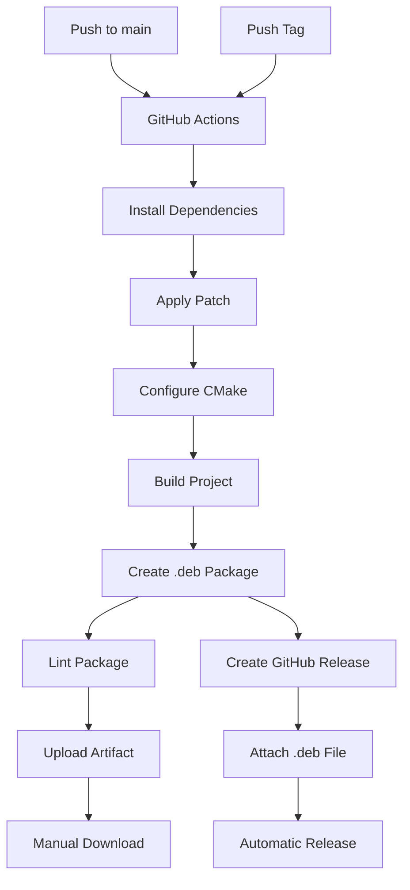

# SendSpin Client CI/CD Guide

This guide explains how to use the complete CI/CD pipeline for building, testing, and releasing the SendSpin client.

## 🎯 Overview

The project now includes a complete CI/CD pipeline with:
- **GitHub Actions workflow** for automated builds
- **Debian packaging** for professional distribution
- **Patch management** for clean submodule usage
- **Release automation** for version management

## 🚀 Quick Start

### 1. Set Up GitHub Actions

The workflow is already configured in `.github/workflows/build-debian-package.yml`. It will automatically:
- Build on every push to `main`
- Create releases when you push tags
- Upload build artifacts

### 2. Push Your Code

```bash
git add .
git commit -m "Add CI/CD pipeline"
git push origin main
```

The workflow will run automatically and build your Debian package.

### 3. Download the Package

After the workflow completes:
1. Go to **Actions** → **Build Debian Package**
2. Click on the latest run
3. Download the `debian-package` artifact

## 📦 Release Management

### Creating a Release

```bash
# Tag your commit
git tag -a v0.1.0 -m "First stable release"
git push origin v0.1.0
```

The workflow will:
- Build the Debian package
- Create a GitHub Release
- Attach the `.deb` file
- Generate release notes

### Versioning Strategy

Use **Semantic Versioning** (`MAJOR.MINOR.PATCH`):
- `v1.0.0` - Major release (breaking changes)
- `v1.1.0` - Minor release (new features)
- `v1.1.1` - Patch release (bug fixes)

## 🔧 Customizing the Workflow

### Change Package Version

Update in these files:

**CMakeLists.txt**:
```cmake
set(CPACK_DEBIAN_PACKAGE_VERSION "0.1.0")
```

**debian/changelog**:
```
sendspin-client (0.1.0-1) unstable; urgency=medium
```

**Workflow file**:
```yaml
env:
  DEB_VERSION: 0.1.0
```

### Add Build Dependencies

Edit the workflow file to add any additional dependencies:

```yaml
- name: Install build dependencies
  run: |
    sudo apt-get install -y \
      build-essential \
      debhelper \
      your-additional-package
```

## 🎯 Workflow Features

### Automatic Builds
- ✅ Triggers on pushes to `main`
- ✅ Skips documentation-only changes
- ✅ Parallel compilation for speed
- ✅ Artifact upload for easy download

### Quality Checks
- ✅ **Lintian** for package quality
- ✅ **CPack** for proper packaging
- ✅ **CMake** configuration validation

### Release Automation
- ✅ Automatic GitHub Releases
- ✅ Package attachment
- ✅ Release notes generation

## 📈 Monitoring Builds

### View Workflow Status

Add this badge to your README:

```markdown

```

### Check Build Logs

```bash
# View recent workflow runs
gh workflow list

# View specific run logs
gh run view <run-id>
```

## 🔄 Advanced CI/CD

### Multi-Architecture Builds

Extend the workflow to build for multiple architectures:

```yaml
jobs:
  build:
    strategy:
      matrix:
        arch: [amd64, arm64, armhf]
    runs-on: ubuntu-20.04
```

### Deployment to PPA

Add a step to upload to your Personal Package Archive:

```yaml
- name: Upload to PPA
  if: github.event_name == 'release'
  run: |
    dput ppa:your-ppa/ppa ../*.changes
```

### Docker Builds

For consistent build environments:

```yaml
- name: Build in Docker
  run: |
    docker run -v $(pwd):/workspace ubuntu:20.04 \
    bash -c "cd /workspace && apt update && apt install -y build-essential && make"
```

## 🐛 Troubleshooting

### Workflow Fails

1. **Check logs** in GitHub Actions
2. **Test locally** with the same commands
3. **Fix dependencies** in the workflow file
4. **Push the fix** to trigger a new build

### Package Not Generated

Ensure:
- CPack is configured in CMakeLists.txt
- All dependencies are installed
- The patch is applied correctly

### Release Not Created

Verify:
- You pushed a tag (not a branch)
- Tag format is `v*.*.*`
- You have push permissions

## 📚 Complete CI/CD Pipeline



## 🎉 Best Practices

### 1. Protect Main Branch

```bash
# Require PR reviews
# Require status checks
# Enable branch protection in GitHub settings
```

### 2. Use Tags for Releases

```bash
# Always tag releases
git tag -a v1.0.0 -m "Release v1.0.0"
git push origin v1.0.0
```

### 3. Test Before Releasing

```bash
# Test the package locally first
sudo dpkg -i your-package.deb
sudo apt --fix-broken install
sendspin-client --version
```

### 4. Monitor Builds

```bash
# Check workflow status regularly
# Fix failures quickly
# Update dependencies as needed
```

## 📈 Example Workflow

### Daily Development

```bash
# Make changes
git add .
git commit -m "Add new feature"
git push origin main

# Workflow builds automatically
# Download artifact for testing
```

### Creating a Release

```bash
# Update version in CMakeLists.txt and changelog
git add .
git commit -m "Bump version to v0.2.0"
git tag -a v0.2.0 -m "Release v0.2.0"
git push origin main
git push origin v0.2.0

# Workflow creates GitHub Release automatically
```

### Hotfix Release

```bash
git checkout -b hotfix/v0.1.1 main
git cherry-pick <commit-hash>
# Update version to v0.1.1
git add .
git commit -m "Fix critical bug"
git tag -a v0.1.1 -m "Hotfix v0.1.1"
git push origin hotfix/v0.1.1
git push origin v0.1.1
# Create PR to main
```

## 🔧 Maintenance Tasks

### Update Dependencies

```bash
# Check for updates
sudo apt update
sudo apt list --upgradable

# Update workflow file with new versions
```

### Clean Up Old Releases

```bash
# In GitHub: Settings → Releases → Delete old releases
# Or use GitHub API
```

### Monitor Security

```bash
# Check for CVEs in dependencies
sudo apt install debsecan
debsecan
```

## 📚 References

- [GitHub Actions](https://docs.github.com/en/actions)
- [Semantic Versioning](https://semver.org/)
- [Debian Packaging](https://www.debian.org/doc/manuals/packaging-manual/)
- [CPack Documentation](https://cmake.org/cmake/help/latest/module/CPack.html)

## 🎯 Summary

You now have a complete CI/CD pipeline that:

✅ **Builds automatically** on every push
✅ **Creates releases** when you push tags
✅ **Generates Debian packages** ready for installation
✅ **Provides artifacts** for manual testing
✅ **Follows best practices** for versioning and deployment

The pipeline is ready for production use on your Raspberry Pi running Debian Bullseye!
